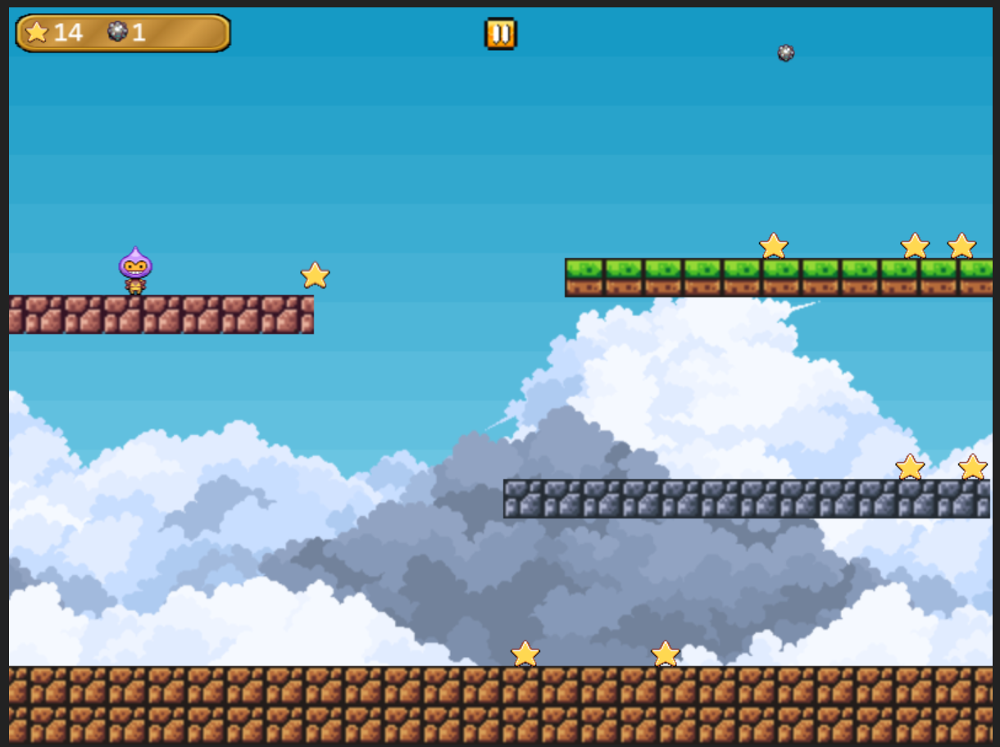

# Phaser 3 tutorial



Code from the Phaser 3 [first game tutorial](https://phaser.io/tutorials/making-your-first-phaser-3-game/part1).

Extends tutorial code with the following changes:
- Typescript types
- Randomize star spawn and spawn constantly on collection
- Player can run off the side and wrap-around
- Display score, bomb count and pause button in dedicated UI scene
- Add a game over and restart scene
- Adds background clouds, platform tiles and music/SFX
- Changes player movement to use acceleration and debounces jumping

## Assets

Image assets from Phaser 3 tutorial:
- https://phaser.io/tutorials/making-your-first-phaser-3-game/part1

Cloud images:
- https://free-game-assets.itch.io/free-sky-with-clouds-background-pixel-art-set

UI pause button:
- https://kicked-in-teeth.itch.io/button-ui

Tiles:
- https://brackeysgames.itch.io/brackeys-platformer-bundle

Sounds:
- Coin: Sound Effect by <a href="https://pixabay.com/users/liecio-3298866/?utm_source=link-attribution&utm_medium=referral&utm_campaign=music&utm_content=190037">LIECIO</a> from <a href="https://pixabay.com//?utm_source=link-attribution&utm_medium=referral&utm_campaign=music&utm_content=190037">Pixabay</a>
- Game over: https://pixabay.com/sound-effects/080047-lose-funny-retro-video-game-80925/
- Music: https://pixabay.com/sound-effects/be-more-serious-loop-275528/

## Installing

Uses vite and node js.

```
npm i --ignore-scripts
npm run dev
```